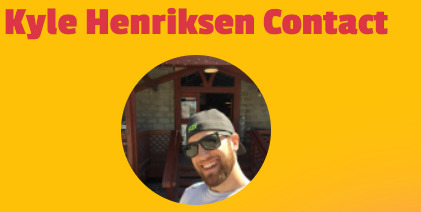
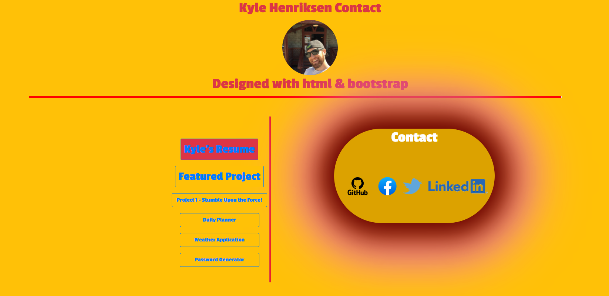

# My Portfolio

<html>
<body style= "backgrond-color: red;">

<h1 align="center">
   
  
   
  My Portfolio
   
</h1>

<h4 align="center">A Team Project assignment for the Denver University bootcamp coding.</h4>

  

  <a href="#key-features">Key Features</a> •
  <a href="#how-to-use">How To Use</a> •
  <a href="#download">Download</a> •
  <a href="#credits">Credits</a> •
  <a href="#authors">Authors</a> •
  

## Key Features

You get to view all my recent work and contact me if you are interested in networking together and collaborate together new material.

## How To Use

[go to my website ](https://starbjornx.github.io/official_portfolio/)

Note: If you're using Linux Bash for Windows, [see this guide](https://www.howtogeek.com/261575/how-to-run-graphical-linux-desktop-applications-from-windows-10s-bash-shell/) or use `node` from the command prompt.

## Download

go to my portfolio website to view any downloadable content. [click here!](https://starbjornx.github.io/official_portfolio/) like my [resume`](./resume.pdf)

## Credits

This software uses the following open source packages:

- [bootstrap](https://getbootstrap.com/)

## Authors

This design is put together by:

[Kyle Henriksen](http://github.com/starbjornx)

# Extra

## License

## MIT

</body>
</html>
